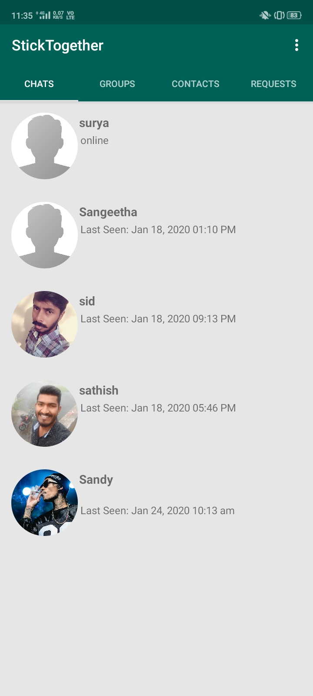
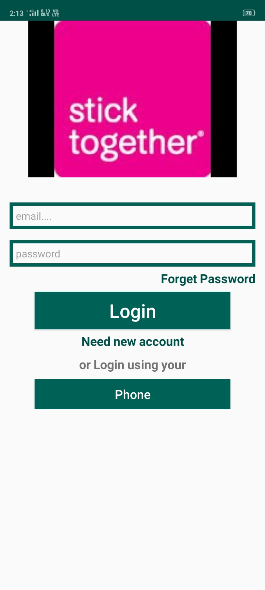
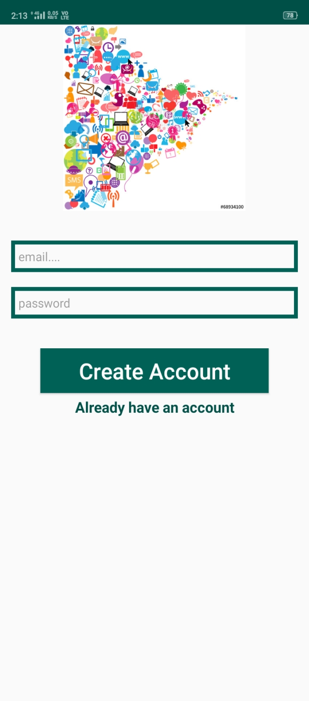

# Stick-Together

StickTogether is a clone of what's app used for communication which has developed in Java. It has some extra features like request a user to talk and the user has control to accept or reject the request. StickTogether uses firebase database and authentication. Objective of ST application is to facilitate text messaging, group chatting option, which is commonly seen in most of the messaging applications and it can also share files and images up to 100MB.

## **Homepage**

## **Loginpage**

## **Sign-in page**

